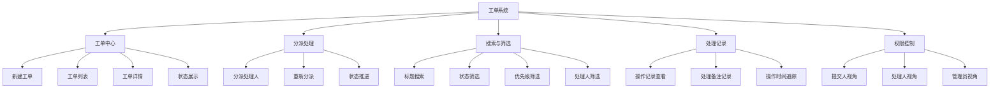

# 功能结构图

```mermaid
flowchart TD
    A["工单系统"] --> B["工单中心"]
    A --> C["分派处理"]
    A --> D["搜索与筛选"]
    A --> E["处理记录"]
    A --> F["权限控制"]

    B --> B1["新建工单"]
    B --> B2["工单列表"]
    B --> B3["工单详情"]
    B --> B4["状态展示"]

    C --> C1["分派处理人"]
    C --> C2["重新分派"]
    C --> C3["状态推进"]

    D --> D1["标题搜索"]
    D --> D2["状态筛选"]
    D --> D3["优先级筛选"]
    D --> D4["处理人筛选"]

    E --> E1["操作记录查看"]
    E --> E2["处理备注记录"]
    E --> E3["操作时间追踪"]

    F --> F1["提交人视角"]
    F --> F2["处理人视角"]
    F --> F3["管理员视角"]
```

确认重点：

- 第一版模块是否缺项
- `处理记录` 是否独立成模块
- `权限控制` 是否只保留基础角色隔离
