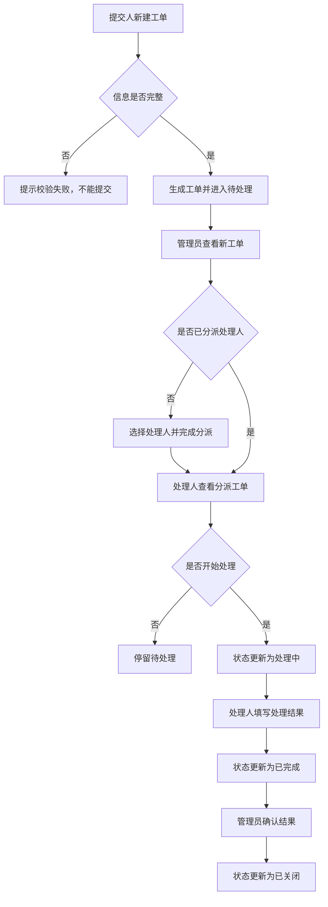

# 核心流程图

```mermaid
flowchart TD
    A["提交人新建工单"] --> B{"信息是否完整"}
    B -- "否" --> B1["提示校验失败，不能提交"]
    B -- "是" --> C["生成工单并进入待处理"]
    C --> D["管理员查看新工单"]
    D --> E{"是否已分派处理人"}
    E -- "否" --> E1["选择处理人并完成分派"]
    E1 --> F["处理人查看分派工单"]
    E -- "是" --> F
    F --> G{"是否开始处理"}
    G -- "否" --> G1["停留待处理"]
    G -- "是" --> H["状态更新为处理中"]
    H --> I["处理人填写处理结果"]
    I --> J["状态更新为已完成"]
    J --> K["管理员确认结果"]
    K --> L["状态更新为已关闭"]
```

确认重点：

- 是否允许管理员直接推进状态
- `已完成 -> 已关闭` 是否必须经过管理员确认
- 是否需要补充退回重处理的分支
