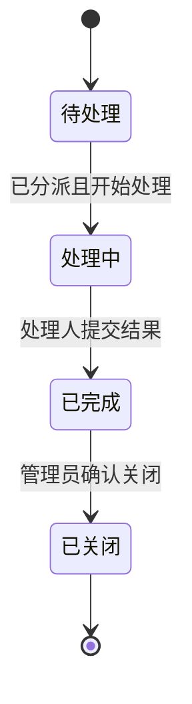

# 状态流转图

```mermaid
stateDiagram-v2
    [*] --> 待处理
    待处理 --> 处理中: 已分派且开始处理
    处理中 --> 已完成: 处理人提交结果
    已完成 --> 已关闭: 管理员确认关闭
    已关闭 --> [*]
```

规则说明：

- 不允许跳级流转
- 未分派处理人时，不可从 `待处理` 进入 `处理中`
- `已关闭` 默认不可再编辑

确认重点：

- 是否需要补 `已完成 -> 处理中` 的回退能力
- 是否需要补 `待处理 -> 已关闭` 的取消关闭能力
