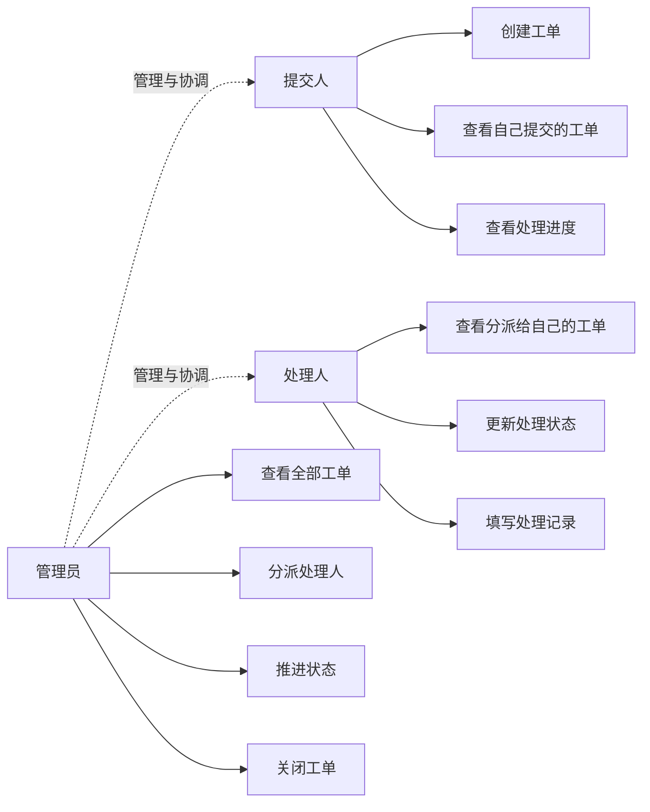

# 角色关系图

```mermaid
flowchart LR
    A["提交人"] --> A1["创建工单"]
    A --> A2["查看自己提交的工单"]
    A --> A3["查看处理进度"]

    B["处理人"] --> B1["查看分派给自己的工单"]
    B --> B2["更新处理状态"]
    B --> B3["填写处理记录"]

    C["管理员"] --> C1["查看全部工单"]
    C --> C2["分派处理人"]
    C --> C3["推进状态"]
    C --> C4["关闭工单"]

    C -. 管理与协调 .-> A
    C -. 管理与协调 .-> B
```

确认重点：

- 管理员是否保留直接关闭工单的能力
- 处理人是否只能处理分派给自己的工单
- 提交人是否只允许查看自己提交的工单
