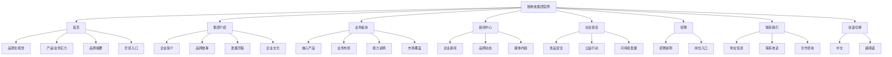

# 功能结构图

```mermaid
flowchart TD
    A["脱骨侠集团官网"] --> B["首页"]
    A --> C["集团介绍"]
    A --> D["业务板块"]
    A --> E["新闻中心"]
    A --> F["社会责任"]
    A --> G["招聘"]
    A --> H["联系我们"]
    A --> I["双语切换"]

    B --> B1["品牌主视觉"]
    B --> B2["产品/业务实力"]
    B --> B3["品牌摘要"]
    B --> B4["栏目入口"]

    C --> C1["企业简介"]
    C --> C2["品牌故事"]
    C --> C3["发展历程"]
    C --> C4["企业文化"]

    D --> D1["核心产品"]
    D --> D2["业务布局"]
    D --> D3["能力说明"]
    D --> D4["市场覆盖"]

    E --> E1["企业新闻"]
    E --> E2["品牌动态"]
    E --> E3["媒体内容"]

    F --> F1["食品安全"]
    F --> F2["公益行动"]
    F --> F3["可持续发展"]

    G --> G1["招聘说明"]
    G --> G2["岗位入口"]

    H --> H1["地址信息"]
    H --> H2["联系电话"]
    H --> H3["合作咨询"]

    I --> I1["中文"]
    I --> I2["越南语"]
```

确认重点：

- 一级栏目是否齐全
- 首页是否足够突出产品/业务实力
- 社会责任是否明确把 `食品安全` 作为重点内容
