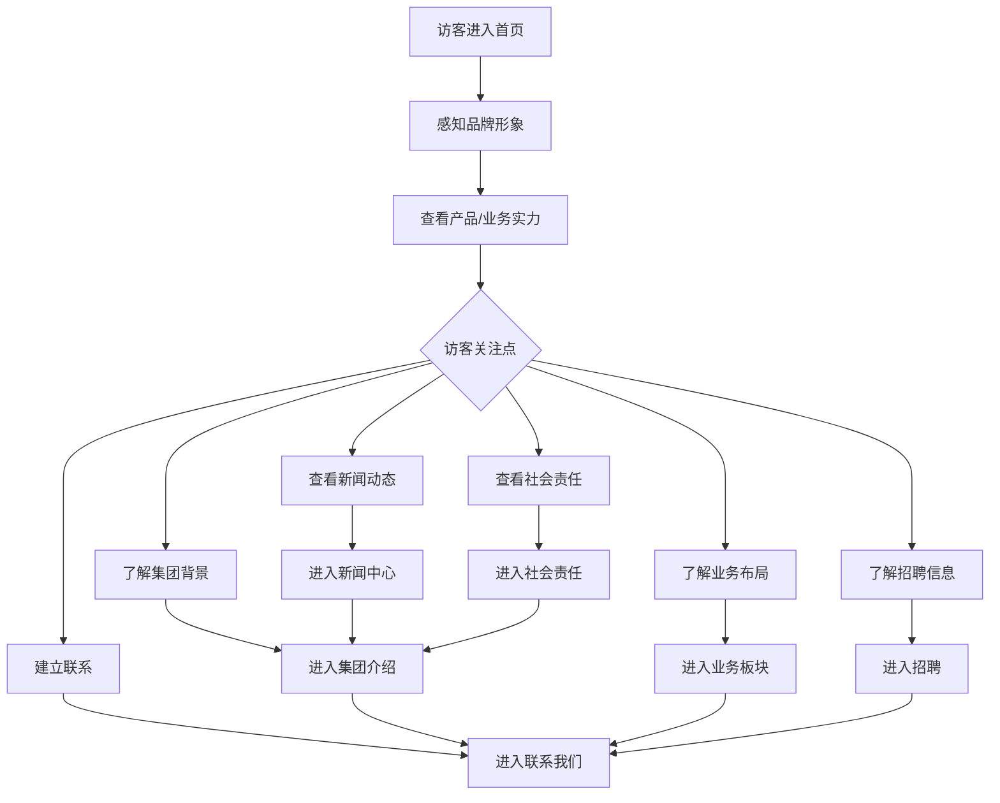

# 核心浏览流程图

```mermaid
flowchart TD
    A["访客进入首页"] --> B["感知品牌形象"]
    B --> C["查看产品/业务实力"]
    C --> D{"访客关注点"}

    D --> E["了解集团背景"]
    D --> F["了解业务布局"]
    D --> G["查看新闻动态"]
    D --> H["查看社会责任"]
    D --> I["了解招聘信息"]
    D --> J["建立联系"]

    E --> E1["进入集团介绍"]
    F --> F1["进入业务板块"]
    G --> G1["进入新闻中心"]
    H --> H1["进入社会责任"]
    I --> I1["进入招聘"]
    J --> J1["进入联系我们"]

    E1 --> J1
    F1 --> J1
    G1 --> E1
    H1 --> E1
    I1 --> J1
```

确认重点：

- 首页是否应直接把访客引导到 `业务板块`
- 新闻、责任、招聘是否需要在首页提供更强入口
- 联系动作是否主要通过 `联系我们` 收口
