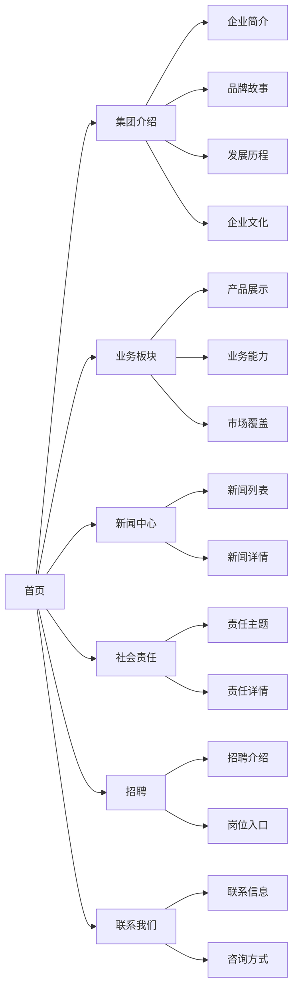

# 页面结构图

```mermaid
flowchart LR
    A["首页"] --> B["集团介绍"]
    A --> C["业务板块"]
    A --> D["新闻中心"]
    A --> E["社会责任"]
    A --> F["招聘"]
    A --> G["联系我们"]

    B --> B1["企业简介"]
    B --> B2["品牌故事"]
    B --> B3["发展历程"]
    B --> B4["企业文化"]

    C --> C1["产品展示"]
    C --> C2["业务能力"]
    C --> C3["市场覆盖"]

    D --> D1["新闻列表"]
    D --> D2["新闻详情"]

    E --> E1["责任主题"]
    E --> E2["责任详情"]

    F --> F1["招聘介绍"]
    F --> F2["岗位入口"]

    G --> G1["联系信息"]
    G --> G2["咨询方式"]
```

结构建议：

- 第一版保持一级导航清晰，不要过多下沉层级
- 新闻、社会责任可保留 `列表 -> 详情` 二层结构
- 招聘先按“介绍 + 岗位入口”理解，是否扩成完整列表后续确认
