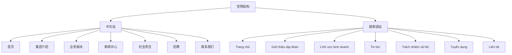

# 双语结构说明

```mermaid
flowchart TD
    A["官网结构"] --> B["中文站"]
    A --> C["越南语站"]

    B --> B1["首页"]
    B --> B2["集团介绍"]
    B --> B3["业务板块"]
    B --> B4["新闻中心"]
    B --> B5["社会责任"]
    B --> B6["招聘"]
    B --> B7["联系我们"]

    C --> C1["Trang chủ"]
    C --> C2["Giới thiệu tập đoàn"]
    C --> C3["Lĩnh vực kinh doanh"]
    C --> C4["Tin tức"]
    C --> C5["Trách nhiệm xã hội"]
    C --> C6["Tuyển dụng"]
    C --> C7["Liên hệ"]
```

当前建议：

- 一级栏目双语结构保持一致
- 页面层级和导航顺序保持一致
- 内容翻译尽量一一对应，避免一套中文结构、一套越南语结构

待确认：

- 越南语命名是否后续由人工统一审校
- 两种语言是否要求同步上线全部栏目
